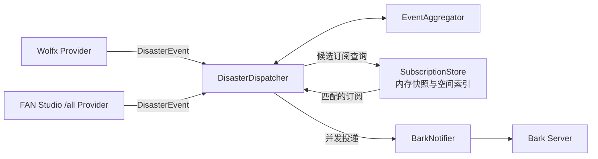

# 灾害预警 Bark 订阅系统

基于 Rust 长驻后端的多渠道灾害实时推送服务。后端同时监听 Wolfx 地震预警和 FAN Studio `/all` WebSocket，将不同来源统一分类、跨渠道去重，再按订阅者地点和灾种规则通过 Bark 推送。

示例：<http://alert.noctiro.moe>

## 数据流

1. Wolfx 和 FAN Studio 分别通过一个 WebSocket 连接向后端推送数据
2. FAN Studio `/all` 消息按 `source` 自动分类为地震预警、地震信息、气象预警、海啸或台风
3. 两个渠道的地震报告进入共享聚合器，避免同一事件重复通知
4. 订阅快照在内存中完成地点、灾种、来源和阈值匹配，再通过 Bark 连接池并发推送

## 后端架构



- `providers/` 是供应商边界。每个适配器只负责 WebSocket 生命周期、供应商协议解析和 `DisasterEvent` 标准化，不访问数据库或 Bark
- `models/` 只包含共享灾害事件和当前订阅格式，不包含 Wolfx 或 FAN Studio 协议结构
- `source_registry.rs` 是来源 ID、渠道、灾种和前端来源选项的唯一注册表
- `lifecycle.rs` 统一管理进程信号、HTTP/provider/dispatcher 的关停顺序、任务回收和 sled 刷新
- `DisasterDispatcher` 统一执行有界队列、跨渠道聚合、候选订阅索引查询、精确匹配、并发通知和有限重试
- 队列满时对来源施加背压，并按事件版本合并更新，不丢弃已有预警；`/api/status` 可观察连接和背压计数
- `EventAggregator` 只处理跨渠道事件关联与投递版本，不包含供应商协议判断

## 技术栈

- **服务端**：Rust、Axum、sled、tokio-tungstenite、reqwest（rustls）
- **Web 界面**：单文件 `web/index.html`，原生 JS、Leaflet + CartoCDN 地图
- **发布形式**：Web 界面编译进 Rust 二进制，整个应用只需运行一个进程

## 项目结构

```text
src/                   Rust 应用源代码
src/lifecycle.rs       进程生命周期和优雅关停协调器
web/index.html         Web 界面源文件
build.rs               构建时压缩 Web 界面并写入 OUT_DIR
Cargo.toml             Rust crate 和构建配置
.env.example           环境变量示例
```

## 部署

灾害监听、订阅 API、Bark 推送和 Web 界面由同一个 Rust 进程提供：

```bash
cp .env.example .env
cargo build --release
./target/release/disaster-alert
```

默认监听 `0.0.0.0:30010`，浏览器访问 `http://your-server:30010` 即可使用。生产环境建议将 `SERVER_HOST` 设为 `127.0.0.1`，再由运行环境已有的反向代理提供 HTTPS；进程守护、域名和证书配置也由实际运行环境管理。

sled 是本地嵌入式数据库：部署时必须持久化 `DB_PATH` 所在目录，且同一数据库目录只能由一个服务实例打开。当前版本不支持多个容器共享该数据库或水平扩容；`/health` 是唯一健康探针，只表示 HTTP 服务可响应。

## 配置

应用启动时自动读取当前工作目录的 `.env`，也支持由 shell 或进程管理器设置环境变量。进程环境变量的优先级高于 `.env`，`.env` 不存在时使用进程环境变量或默认值：

```bash
cp .env.example .env
vim .env
./target/release/disaster-alert
```

配置值会在启动时校验；`.env` 语法错误、数值格式错误、重连下限大于上限、非正波速、无效并发上限等会直接导致服务启动失败。服务由其他目录启动时，需要将工作目录设置为 `.env` 所在目录，或直接通过进程管理器注入环境变量。

`BARK_URL_ALLOWLIST` 支持 HTTP/HTTPS、域名或 IP、显式端口和反向代理子路径，例如 `https://api.day.app`、`http://192.168.1.10:8080`、`https://example.com/bark`。不允许凭据、查询参数或 fragment；末尾 `/` 会被移除，推送时统一追加 `/push`。配置顺序会原样提供给网页端；网页端首次使用时选择第一项。服务端不会把第一项当作发送失败或历史地址失效时的回退目标。

| 变量 | 默认值 | 说明 |
| --- | --- | --- |
| `SERVER_HOST` | `0.0.0.0` | 监听地址 |
| `SERVER_PORT` | `30010` | 服务端口 |
| `SHUTDOWN_TIMEOUT_SECONDS` | `15` | 任务排空的最长等待秒数，也是最终数据库刷新超时失败的判定阈值，范围 `1..=300`；已开始的刷新仍会完成后再退出 |
| `ALLOWED_ORIGINS` | (空) | 允许跨域访问 API 的前端 Origin，多个值用逗号分隔；空表示不额外开放跨域 |
| `DB_PATH` | `./data/disaster-alert.db` | 灾害订阅数据库路径 |
| `BARK_URL_ALLOWLIST` | `https://api.day.app` | 前端可选的 Bark 基础 URL 有序白名单，支持 HTTP/HTTPS、端口、IP 和反代子路径；多个值用逗号分隔 |
| `BARK_SOUND` | (空) | Bark 铃声名称，空表示使用默认 |
| `BARK_VOLUME` | `10` | Bark 推送音量 (0-10) |
| `BARK_GROUP` | `灾害预警` | Bark 推送分组名 |
| `BARK_CALL` | `true` | 是否触发 Bark 通话级别推送；默认重复播放通知铃声 |
| `WOLFX_WEBSOCKET_URL` | `wss://ws-api.wolfx.jp/all_eew` | Wolfx 聚合地震预警 WebSocket 地址 |
| `FANSTUDIO_WEBSOCKET_URL` | `wss://ws.fanstudio.tech/all` | FAN Studio 单一聚合 WebSocket 地址，必须使用 `/all` 端点 |
| `RECONNECT_MIN_SECONDS` | `1` | 重连最小间隔秒数 |
| `RECONNECT_MAX_SECONDS` | `30` | 指数退避重连最大间隔秒数 |
| `PUSH_UPDATES` | `false` | 是否推送同一事件的后续报告 |
| `UPDATE_MIN_REPORT_GAP` | `1` | 同事件两次推送之间至少间隔的报告数 |
| `IGNORE_TRAINING` | `true` | 是否跳过演练事件 |
| `IGNORE_CANCEL` | `false` | 是否跳过取消/解除事件；通常应保留解除通知 |
| `P_WAVE_KM_S` | `6.0` | P 波传播速度 (km/s) |
| `S_WAVE_KM_S` | `3.5` | S 波传播速度 (km/s) |
| `STALE_ORIGIN_SECONDS` | `600` | 发震时间超过该秒数视为过期 |
| `DEDUP_KEEP_MINUTES` | `120` | 事件去重窗口分钟数 |
| `MAX_CONCURRENT_NOTIFICATIONS` | `200` | 并发推送上限；实际值不会超过 `HTTP_POOL_SIZE` |
| `HTTP_POOL_SIZE` | `200` | HTTP 连接池大小 |
| `REVERSE_GEOCODING_ENABLED` | `true` | 选点或定位后是否自动解析省、市、区；关闭后仍可手动填写 |
| `REVERSE_GEOCODING_URL` | `https://nominatim.openstreetmap.org/reverse` | Nominatim 兼容的反向地理编码端点；生产环境可改为自建服务 |

## API

所有接口返回统一 JSON：

```json
{
  "success": true,
  "message": "订阅已保存，确认通知已发送",
  "data": {}
}
```

网页通过 `GET /api/reverse-geocode?latitude=...&longitude=...` 自动补全监测地点的行政区域。后端代理并缓存结果，不会把第三方地址直接暴露给浏览器；外部服务不可用时仍可手动填写并保存订阅。

失败时 `success` 为 `false`，`data` 字段省略，`message` 返回可展示的错误原因

| 方法 | 路径 | 用途 | 成功响应 |
| --- | --- | --- | --- |
| `POST` | `/api/subscribe` | 发送 Bark 接收测试通知成功后创建或覆盖订阅 | `200` |
| `POST` | `/api/test-alert` | 使用当前页面的单条灾害规则发送模拟预警，不保存订阅 | `200` |
| `GET` | `/api/bark-urls` | 返回网页端可选择的 Bark URL 白名单 | `200` |
| `GET` | `/api/subscription-options` | 返回灾害类别、来源目录和默认阈值 | `200` |
| `DELETE` | `/api/unsubscribe` | 按 Bark 服务与 Key 删除订阅 | `200` |
| `GET` | `/api/stats` | 返回订阅总数 | `200` |
| `GET` | `/api/status` | 返回两个渠道的连接、消息、解析错误、重连和队列背压指标 | `200` |
| `GET` | `/health` | 健康检查 | `200` |

### `POST /api/subscribe`

请求体：

```json
{
  "destination": {
    "type": "bark",
    "base_url": "https://api.day.app",
    "device_key": "key"
  },
  "targets": [
    {
      "label": "东京",
      "point": { "latitude": 35.6, "longitude": 139.6 },
      "region": { "province": "东京都", "city": "东京", "district": "" }
    }
  ],
  "alerts": [
    {
      "category": "earthquake_warning",
      "sources": { "mode": "all" },
      "estimated_intensity_bands": [
        { "min": 1, "max": 1, "interruption_level": "passive" },
        { "min": 2, "max": 2, "interruption_level": "active" },
        { "min": 3, "max": 7, "interruption_level": "critical" }
      ]
    },
    {
      "category": "earthquake_report",
      "sources": { "mode": "include", "ids": ["fanstudio.cenc", "fanstudio.usgs"] },
      "min_magnitude": 4.5
    },
    {
      "category": "weather_warning",
      "sources": { "mode": "all" },
      "min_severity": 2,
      "fallback_radius_km": 100
    },
    {
      "category": "tsunami",
      "sources": { "mode": "all" },
      "min_severity": 2
    },
    {
      "category": "typhoon",
      "sources": { "mode": "all" },
      "max_center_distance_km": 300
    }
  ]
}
```

字段说明：

| 字段 | 当前请求要求 | 说明 |
| --- | --- | --- |
| `destination` | 是 | 推送目的地。当前仅支持 `type: "bark"` |
| `destination.base_url` | 是 | 必须精确匹配后端 `BARK_URL_ALLOWLIST` 中规范化后的 URL |
| `destination.device_key` | 是 | Bark Key，只允许字母和数字，最长 64 字符 |
| `targets` | 是 | 监测目标列表，至少 1 个、最多 3 个 |
| `targets[].label` | 否 | 地点名称，最多 80 个字符 |
| `targets[].point` | 是 | 有效坐标范围为纬度 `-90..90`、经度 `-180..180` |
| `targets[].region` | 否 | 省、市、区字段，用于天气和海啸行政区匹配 |
| `alerts` | 是 | 启用的灾害规则。未出现的灾种不订阅，类别不能重复 |
| `alerts[].sources` | 是 | 来源选择。`all` 表示包括将来新增的同类来源；`include` 为固定来源白名单 |
| `earthquake_warning.estimated_intensity_bands` | 是 | 最多 3 条、范围为 `0..7`、不能重叠。未覆盖的烈度不发送通知 |
| `earthquake_report.min_magnitude` | 是 | 最低震级，范围 `0..10` |
| `weather_warning.min_severity` / `tsunami.min_severity` | 是 | 最低严重度，范围 `1..4` |
| `weather_warning.fallback_radius_km` | 是 | 未提供行政区命中时的坐标回退半径，范围 `1..2000` 公里 |
| `typhoon.max_center_distance_km` | 是 | 台风中心最大距离，范围 `1..3000` 公里 |

说明：

- 取消或解除事件只发送给此前成功收到同一事件的设备，不会重新按当前订阅规则匹配
- 地震速报沿用全局候选订阅匹配；天气、海啸和台风的空间匹配分别由规则字段决定
- `/api/subscription-options` 返回按灾种组织的来源目录及每种规则的完整默认值，Web 界面以此生成配置
- 订阅身份是 `destination.base_url` 与 `destination.device_key` 的组合；同一 Key 可用于不同 Bark 服务，分别保存和删除
- 订阅和退订 JSON 请求体上限为 32 KiB；超限或结构无效时返回统一 JSON `400`
- Bark 接收测试通知使用 `timeSensitive` 级别以提高即时横幅的可见性，但不会使用灾害专用的 `BARK_SOUND`、`BARK_VOLUME` 或 `BARK_CALL`；最终是否显示横幅仍取决于设备的 Bark 通知权限和系统设置

成功响应：

```json
{
  "success": true,
  "message": "订阅已保存，确认通知已发送",
  "data": { "saved": true }
}
```

常见失败：

| 状态码 | 原因 |
| --- | --- |
| `400` | `destination.device_key` 为空、过长或包含非字母数字字符 |
| `400` | Bark URL 无效或不在白名单中 |
| `400` | 没有有效监测地点 |
| `400` | 灾害规则为空、类别重复、来源不属于对应灾种或阈值超出范围 |
| `502` | Bark 接收测试通知发送失败，订阅未保存 |
| `500` | 数据库存储失败 |

### `DELETE /api/unsubscribe`

请求体：

```json
{
  "destination": {
    "type": "bark",
    "base_url": "https://api.day.app",
    "device_key": "key"
  }
}
```

成功响应：

```json
{
  "success": true,
  "message": "已取消订阅"
}
```

常见失败：

| 状态码 | 原因 |
| --- | --- |
| `400` | `destination` 无效，或其中的 Bark Key / Bark URL 无效 |
| `404` | 当前 Bark 服务与 Key 没有对应订阅 |
| `500` | 数据库删除失败 |

### `GET /api/stats`

返回订阅总数，不返回 Bark Key、位置、通知规则或订阅时间：

```json
{
  "success": true,
  "message": "统计成功",
  "data": { "total_subscriptions": 12 }
}
```

### `GET /health`

健康检查只表示 HTTP 服务可响应：

```json
{
  "success": true,
  "message": "OK"
}
```

### 隐私边界

系统不提供「输入 Bark Key 查询订阅内容」的接口，Bark Key 不能反查用户位置、通知级别或订阅时间，详见 [CONTRIBUTING.md](CONTRIBUTING.md) 中的隐私确认

## 致谢

- 数据源：[wolfx.jp](https://ws-api.wolfx.jp)
- 数据源：[FAN Studio](https://api.fanstudio.tech/doc/ws-api/#home)
- 推送服务：[Bark](https://github.com/Finb/Bark)
